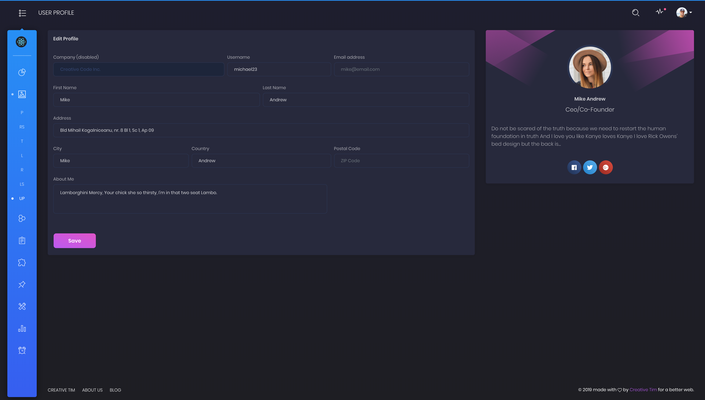
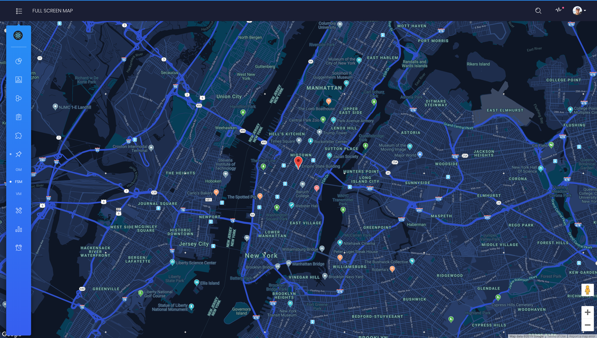

# [YOOTO Dashboard PRO React]() 


 []() []() 


Special thanks go for the owners of these plugins:
- [nouislider](https://refreshless.com/nouislider/)
- [nucleoapp](https://nucleoapp.com/?ref=1712)
- [perfect-scrollbar](https://www.npmjs.com/package/perfect-scrollbar)
- [react-big-calendar](https://github.com/intljusticemission/react-big-calendar)
- [react-bootstrap-sweetalert](https://github.com/djorg83/react-bootstrap-sweetalert)
- [react-bootstrap-switch](https://github.com/Julusian/react-bootstrap-switch)
- [react-datetime](https://github.com/YouCanBookMe/react-datetime)
- [react-select](https://github.com/JedWatson/react-select)
- [react-table](https://react-table.js.org/#/story/readme)
- [react-tagsinput](https://github.com/olahol/react-tagsinput)

## Table of Contents

* [Demo](#demo)
* [Documentation](#documentation)
* [File Structure](#file-structure)
* [Browser Support](#browser-support)
* [Resources](#resources)
* [Reporting Issues](#reporting-issues)
* [Technical Support or Questions](#technical-support-or-questions)
* [Licensing](#licensing)
* [Useful Links](#useful-links)


| Dashboard | User Profile | Tables | Maps | Notification |
| --- | --- | --- | --- | --- |
| [](https://demos.creative-tim.com/black-dashboard-pro-react/#/admin/dashboard) | [](https://demos.creative-tim.com/black-dashboard-pro-react/#/admin/user-profile) | [](https://demos.creative-tim.com/black-dashboard-pro-react/#/admin/extended-tables) | [](https://demos.creative-tim.com/black-dashboard-pro-react/#/admin/full-screen-map) | [](https://demos.creative-tim.com/black-dashboard-pro-react/#/admin/notifications)

## File Structure

Within the download you'll find the following directories and files:

```
black-dashboad-pro-react
.
│
├── CHANGELOG.md
├── README.md
├── package.json
├── Documentation
│   └── documentation.html
├── public
│   └── index.html
└── src
    ├── index.js
    ├── routes.js
    ├── logo.svg
    ├── assets
    │   ├── css
    │   ├── demo
    │   ├── fonts
    │   ├── img
    │   └── scss
    │       ├── black-dashboard-pro-react
    │       │   ├── bootstrap
    │       │   │   ├── mixins
    │       │   │   └── utilities
    │       │   ├── custom
    │       │   │   ├── cards
    │       │   │   ├── mixins
    │       │   │   ├── utilities
    │       │   │   └── vendor
    │       │   └── react
    │       │       └── plugins
    │       └── black-dashboard-pro-react.scss
    ├── components
    │   ├── CustomUpload
    │   │   └── ImageUpload.jsx
    │   ├── FixedPlugin
    │   │   └── FixedPlugin.jsx
    │   ├── Footer
    │   │   └── Footer.jsx
    │   ├── Navbars
    │   │   ├── AdminNavbar.jsx
    │   │   ├── AuthNavbar.jsx
    │   │   └── RTLNavbar.jsx
    │   ├── Sidebar
    │   │   └── Sidebar.jsx
    │   └── SortingTable
    │       └── SortingTable.jsx
    ├── layouts
    │   ├── Admin
    │   │   └── Admin.jsx
    │   ├── Auth
    │   │   └── Auth.jsx
    │   └── RTL
    │       └── RTL.jsx
    ├── variables
    │   ├── charts.jsx
    │   ├── general.jsx
    │   └── icons.jsx
    └── views
        ├── Calendar.jsx
        ├── Charts.jsx
        ├── Dashboard.jsx
        ├── Widgets.jsx
        ├── components
        │   ├── Buttons.jsx
        │   ├── Grid.jsx
        │   ├── Icons.jsx
        │   ├── Notifications.jsx
        │   ├── Panels.jsx
        │   ├── SweetAlert.jsx
        │   └── Typography.jsx
        ├── forms
        │   ├── ExtendedForms.jsx
        │   ├── RegularForms.jsx
        │   ├── ValidationForms.jsx
        │   ├── Wizard.jsx
        │   └── WizardSteps
        │       ├── Step1.jsx
        │       ├── Step2.jsx
        │       └── Step3.jsx
        ├── maps
        │   ├── FullScreenMap.jsx
        │   ├── GoogleMaps.jsx
        │   └── VectorMap.jsx
        ├── pages
        │   ├── Lock.jsx
        │   ├── Login.jsx
        │   ├── Pricing.jsx
        │   ├── Register.jsx
        │   ├── Rtl.jsx
        │   ├── Timeline.jsx
        │   └── User.jsx
        └── tables
            ├── ExtendedTables.jsx
            ├── ReactTables.jsx
            └── RegularTables.jsx
```

## Browser Support

At present, we officially aim to support the last two versions of the following browsers:

    

## Reporting Issues
We use GitHub Issues as the official bug tracker for the YOOTO Dashboard PRO React. Here are some advices for our users that want to report an issue:

1. Make sure, that you are using the latest version of the YOOTO Dashboard PRO React. Check the CHANGELOG from your dashboard.
2. Providing us reproducible steps for the issue will shorten the time it takes for it to be fixed.
3. Some issues may be browser specific, so specifying in what browser you encountered the issue might help.

## Technical Support or Questions

If you have questions or need help integrating the product please [contact us]() instead of opening an issue.

## Licensing

- Copyright 2020 Yooto online (https://www.yooto.online)
- YOOTO [License](https://yooto.online/pages/terms-conditions)

## Useful Links

Social Media:

Twitter: <https://twitter.com/#>

Facebook: <https://www.facebook.com/yooto.online/>

Google+: <https://plus.google.com/>

Instagram: <https://instagram.com/>
